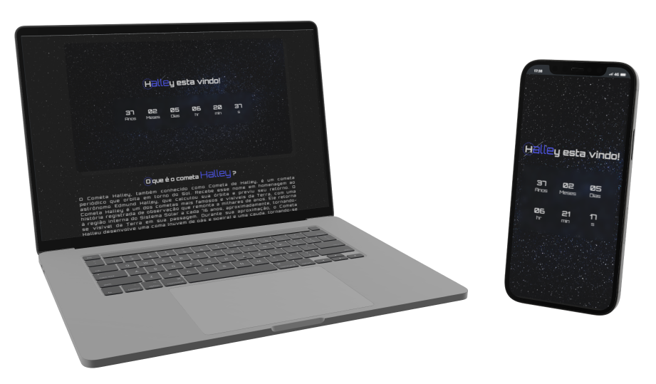

#  [Halley](https://carloscunha611.github.io/countdown-timer/)

    

> O site de contagem regressiva para o Cometa Halley é um projeto desenvolvido em JavaScript, HTML e CSS. Ele apresenta uma interface visualmente atraente que mostra a contagem regressiva para a próxima passagem do Cometa Halley.

## Funcionalidades e descrições

- Site otimizado para acesso em dispositivos móveis, tablets e desktops.
- Permite aos usuários visualizar em tempo real quanto tempo falta para a próxima passagem do cometa.
- Design limpo, simples e temático.

## ⚙ Tecnologias

- HTML5
- CSS3
- JavaScript
- Git / GitHub

## 🔗 Portfólio e links

  
  

